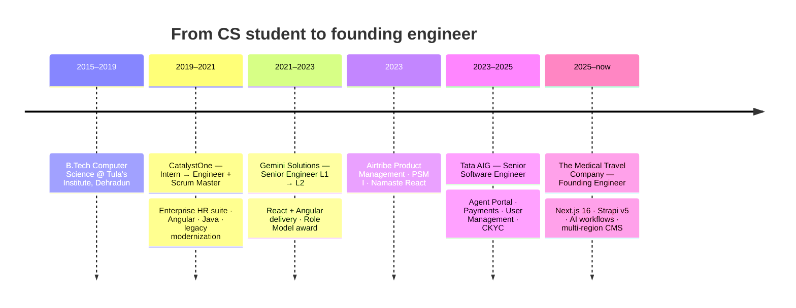

# Pushpender Singh

**Full Stack Engineer · Founding Engineer**

Founding Engineer at **The Medical Travel Company** — I own product architecture, frontend systems, APIs, and delivery from first commit to production.

[Email](mailto:pushpendersingh311@gmail.com) · [LinkedIn](https://www.linkedin.com/in/pushpendersingh97) · [GitHub](https://github.com/pushpendersingh97)

---

## What I do

I take web products from idea to something people can use — architecture, UI, APIs, CMS, SEO, and the last mile of shipping.

| I can own                    | How it shows up                                                           |
| ---------------------------- | ------------------------------------------------------------------------- |
| **0→1 product builds**       | Founding engineer on a multi-region medical-travel platform               |
| **Full-stack Next.js**       | App Router, ISR, middleware, webhooks, geo routing, technical SEO         |
| **Headless CMS**             | Strapi v5 + GraphQL/REST, localized content, on-demand revalidation       |
| **Enterprise frontends**     | Insurance agent portals, payments, user management, CKYC                  |
| **Motion & storytelling UI** | Scroll-driven portfolios, sticky scrollytelling, reduced-motion fallbacks |
| **AI-first workflows**       | Patient docs, travel coordination, LLM-assisted delivery                  |
| **Teams**                    | Led 2–3 engineers, mentored juniors, served as Scrum Master               |

---

## Journey

### The path, in plain words

Started in **enterprise HR** at CatalystOne — intern to engineer, then Scrum Master — rewriting legacy Angular/Java modules into something teams could actually ship.

Moved to **Gemini Solutions** and leveled L1 → L2 while owning frontend on a large insurance platform (React + Angular). Mentored teammates, ran Agile delivery, and was named **Role Model** for the team.

Joined **Tata AIG** as Senior Software Engineer. Independently built Payment and Generic modules for the Agent Portal, owned User Management frontend, integrated CKYC across apps, and led a small team through the full SCRUM lifecycle.

In 2025 I became **Founding Engineer** at The Medical Travel Company: Next.js 16 + Strapi v5, geo-based routing, ISR with webhook cache invalidation, a reusable design system, Healthcare CRM, Affiliate Portal, and AI-driven ops for patients and partners.

---

## Tech stack

  

| Layer             | Tools I use in production                                                                        |
| ----------------- | ------------------------------------------------------------------------------------------------ |
| **UI**            | React 19, Next.js 16 (App Router), TypeScript, Tailwind CSS v4, SASS, Material-UI, Framer Motion |
| **State & data**  | Redux Toolkit, GraphQL, REST, native `fetch`, Server Actions                                     |
| **CMS & content** | Strapi v5, i18n, draft/preview, media, webhook invalidation                                      |
| **Platform**      | Vercel, ISR / SSG, middleware, geo routing, technical SEO                                        |
| **Also fluent**   | Angular, Node.js, HTML5 / CSS3, Bootstrap, Java (legacy HR suite)                                |
| **Delivery**      | Scrum (PSM I), code review, mentoring, 0→1 architecture                                          |

---

## GitHub

  
  

  

---

**Building the next thing.** If you want to talk products, frontend architecture, or AI-assisted delivery — [email me](mailto:pushpendersingh311@gmail.com) or find me on [LinkedIn](https://www.linkedin.com/in/pushpendersingh97).

